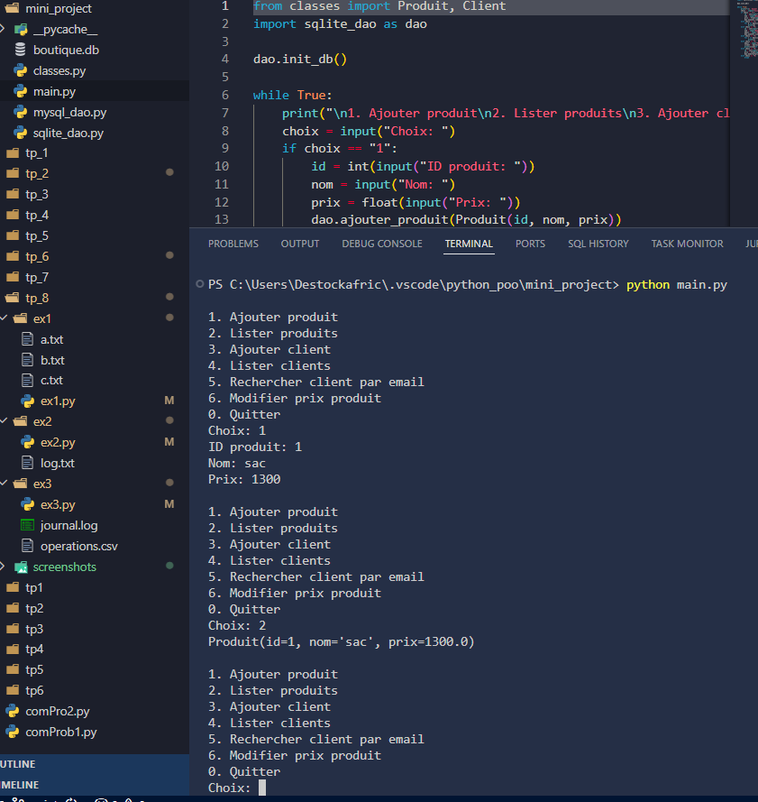

# Mini-Projet Python : Gestion de Produits et Clients

### Présentation
Ce projet consiste à développer une application Python orientée objet pour la gestion d'entités métiers telles que les produits et les clients. Il offre une interface simple pour interagir avec les bases de données SQLite et MySQL, permettant de réaliser des opérations CRUD de manière sécurisée et efficace.

### Objectifs
- Comprendre et appliquer la programmation orientée objet en Python.  
- Manipuler et gérer des bases de données locales et distantes.  
- Implémenter des opérations CRUD pour des entités métiers.  
- Comparer l'utilisation de SQLite et MySQL dans un même contexte applicatif.  

### Technologies utilisées
- Python 3.1  
- SQLite pour la base de données locale  
- MySQL pour la base de données distante  
- MySQL Connector/Python pour la connexion MySQL  
- VS Code comme environnement de développement  

### Structure du Projet
- `classes.py` : définition des classes `Produit` et `Client`.  
- `sqlite_dao.py` : implémentation des opérations CRUD pour SQLite.  
- `mysql_dao.py` : implémentation des opérations CRUD pour MySQL.  
- `main.py` : script principal avec menu CLI pour tester toutes les fonctionnalités.  
- `boutique.db` : base SQLite générée automatiquement.  
- `journal.log` : fichier journal pour les opérations effectuées (si nécessaire).  

### Fonctionnalités
- Ajouter, lister et modifier des produits.  
- Ajouter, lister et rechercher des clients par email.  
- Gestion des prix des produits.  
- Support simultané pour SQLite et MySQL avec une interface identique.  
- Gestion automatique des erreurs de connexion ou d'insertion.  

### Installation
1. Cloner le dépôt ou copier les fichiers du projet dans un dossier local.  
2. Installer Python 3.x et MySQL (pour l'utilisation distante).  
3. Installer le connecteur MySQL : `pip install mysql-connector-python`.  
4. Créer la base MySQL `boutique` si nécessaire.  
5. Vérifier que tous les fichiers Python (`classes.py`, `sqlite_dao.py`, `mysql_dao.py`, `main.py`) sont dans le même répertoire.  

### Utilisation
1. Ouvrir VS Code et sélectionner le dossier du projet.  
2. Exécuter `main.py` dans le terminal intégré.  
3. Utiliser le menu pour ajouter, lister, rechercher ou modifier des entités.  
4. Pour basculer entre SQLite et MySQL, modifier l'import dans `main.py` :  
   - `import sqlite_dao as dao` pour SQLite  
   - `import mysql_dao as dao` pour MySQL  

### Résultats (Capture d’Écran)

